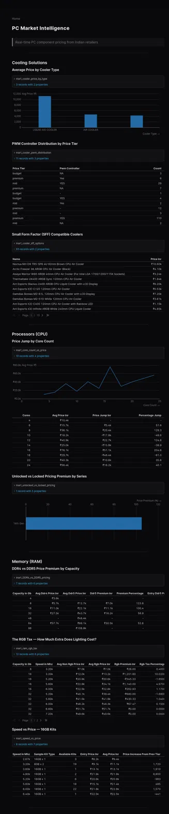
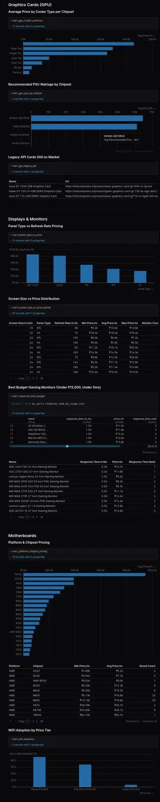

# PC Market Intelligence


> End-to-end data pipeline scraping Indian PC hardware retailers to surface 
> pricing intelligence for PC builders and enthusiasts.




---

## What questions does this answer?

- Which CPU cooler type offers better value — AIO Liquid or Air?
- What is the real **RGB tax** on RAM? (spoiler: up to ₹1,140 extra)
- How much more does **DDR5 cost vs DDR4** at the same capacity?
- Which GPU chipsets require the highest PSU wattage on average?
- What is the **price premium for unlocked processors** by series?
- Which budget monitors (under ₹15,000) hit sub-5ms response times?
- How does WiFi adoption vary across motherboard price tiers?

---

## Architecture

```
Web Scrapers (BS4 + Playwright)
        │
        ▼
  Raw JSON files
        │
        ▼
Polars Cleaning Scripts ──► Parquet files ──► MinIO (Bronze Layer)
        │
        ▼
   DuckDB (bronze schema)
        │
        ▼
   dbt Staging Models (6)
        │
        ▼
   dbt Mart Models (16) ──► 25 tests, all passing
        │
        ▼
  Evidence.dev Dashboard
```

Follows **Medallion Architecture** (Bronze → Silver → Gold).

---

## Tech Stack

| Layer | Tool |
|---|---|
| Ingestion | Python, BeautifulSoup, Playwright |
| Transformation | Polars |
| Storage | DuckDB, MinIO, Parquet |
| Modeling | dbt Core (dbt-duckdb) |
| Dashboard | Evidence.dev |

---

## By the numbers

- **6 categories** scraped: GPUs, Monitors, Processors, RAM, Motherboards, CPU Coolers
- **3 retailers**: MD Computers, Vedant Computers, PrimeABGB
- **841 rows** across 6 DuckDB bronze tables
- **22 dbt models** — 6 staging, 16 analytical marts
- **25 dbt tests** — all passing

---

## Project Structure

```
.
├── PC_MARKET_INTELLIGENCE/   # dbt project (models, tests, schema.yml)
├── ingestion_script/         # Web scrapers (BeautifulSoup + Playwright)
├── sync_script/              # Polars cleaning scripts (bronze layer)
├── dashboard/                # Evidence.dev dashboard
├── prev_data/                # Parquet snapshots at time of commit
├── load_bronze.py            # Loads parquet files into DuckDB bronze schema
└── run_pipeline.py           # Master runner — executes full pipeline
```

---

## How to Run

**Full pipeline (scrape + clean + load):**
```bash
cd pc-market-intelligence
uv run python run_pipeline.py
```

**Skip scraping (use existing parquet snapshots):**
```bash
# Copy parquet files from prev_data/ to project root, then:
uv run python load_bronze.py
```

**Run dbt models and tests:**
```bash
cd PC_MARKET_INTELLIGENCE
dbt run && dbt test
dbt docs generate && dbt docs serve
```

**Launch dashboard:**
```bash
cp ~/pc-market-intelligence/pc_parts.db ~/pc-market-intelligence/dashboard/pc_parts.db
cd dashboard
npm run sources && npm run dev
```

---

## Author

**Kavyansh (krish007code)**  
Focus: Data Engineering · Analytical Engineering · Linux Systems  
Feedback welcome: kavyanshkumarbaghel@gmail.com
